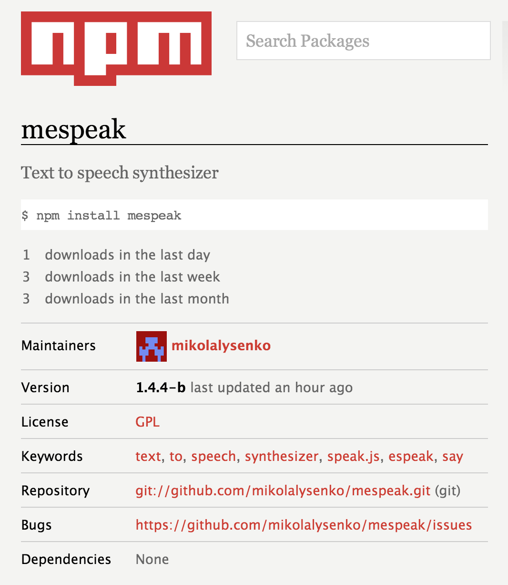
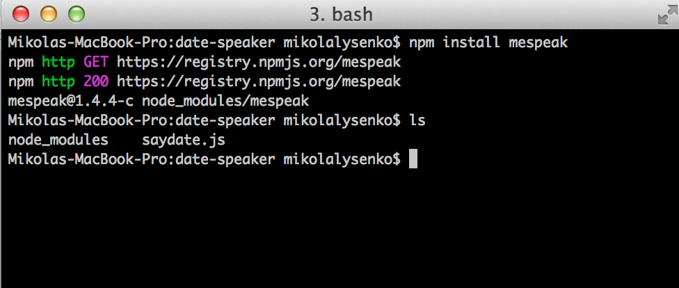
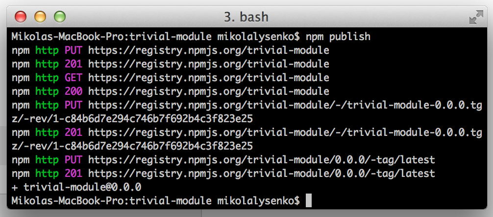

CS558 Technology Lecture 2: Node.js
===================================
Last time we covered the basics of JavaScript.  Today, we will discuss how to write programs in JavaScript that interact with the operating system and other software components.

It is important to note that JavaScript, just like C or C++, is only a language.  It does not come with any built in notion of how to do things read a file, open a network socket or modify a web page.  Instead, these things must be defined by the run time environment.  There are two common environments where JavaScript is usually executed:

1.  The Document Object Model (or DOM), which is the environment that is used by most web browsers.
2.  The NodeJS environment, which is defined by node and exposes a set of primitives for working with operating systems.

While the DOM is the more traditional of these two, it is also vastly more complicated.  Many of the aspects of the DOM are related to things like reading and modifying the contents of a webpage, and for reacting to user events like mouse clicks or key presses.  By comparison, node.js is far simpler environment, primarily owing to the fact that it attempts to solve a much smaller set of problems.  The main goal of node.js is to provide a minimal set of primitives so that you can write system programs like web servers in JavaScript.

In this class, we will be primarily focused on algorithms and data structures and so it superficially won't matter much which environment we pick.  However, because node.js is much simpler than the DOM, we will prefer to write and test all of our programs within node.js, and then later if we want to use them within a browser we can use the same core components and execute them within the DOM.

# Introduction to node.js
As described earlier, node.js is a low level JavaScript environment for writing systems programs.  Broadly speaking the two main things that it provides are:

1.  A collection asynchronous IO primitives for working with files, sockets and other devices.
2.  A module system for organizing large projects and sharing code.

Both of these facilities are quite useful, but for the purposes of this course we will mostly be focusing on the latter.  However, we will touch on the former point a bit as it is worth knowing about it before moving onward.

## Setting up node.js
Installing node.js is relatively painless.  Just go to

* [http://nodejs.org](http://nodejs.org)

Download the installer:


Run it, and you are good to go!

Once it is done, you should be able to open up a shell and run node.  On windows machines this can be done using [powershell](http://en.wikipedia.org/wiki/Windows_PowerShell) or else you can download and set up [cygwin](http://www.cygwin.com/).  To launch node, open your shell and just type `node`:


It will open up an interactive JavaScript console, just like the one in Google Chrome that we used last time.  To close out of the repl press Control+C.

## "Hello World" in node.js
You can also use node.js to execute a script.  To get things started, first create a file in the same directory as your shell called "hello.js" which has the following contents:

```javascript
//Contents of hello.js
console.log("hello world")
```

Once that's done, we can execute the file by typing

```sh
> node hello.js
```

Which if you typed all that in correctly should print out,

```
hello world
```

## Basic file IO
Working with disk devices and other IO primitives in node.js is also pretty easy to do.  For example, here is a demo program that reads a text file called "data.txt" and writes an uppercase version of the file called "loud.txt"

```javascript
//Import file system library
var fs = require("fs")

//First read in the file as UTF8 string
fs.readFile("data.txt", function(err, data) {

  //If there was an error, throw an exception
  if(err) {
    throw err
  }
  
  //Otherwise, write the reversed contents
  var loud = data.toString().toUpperCase()
  
  //Write upper case out
  fs.writeFile("loud.txt", reversed, function(err, data) {
    console.log("done")
  })
})

//Print out a message
console.log("reading...")
```

If you run this program it will print out:

```
reading...
done
```

The important thing to note about this is how the result of reading the file is handled.  Instead of `fs.readFile` returning a file immediately, the code issues a read command to the disk and continues.  Once the file is fully loaded from disk, it then triggers an event which fires the callback that was passed as the second argument.  The callback can then take the data object which is a buffer containing the contents of the file and manipulate that.

Though this may seem a bit strange to those who are more familiar with sequential IO operations in languages like C, it has the advantage that the process is not blocked while waiting for the slow disk IO operation to complete.

To learn more about the `fs` object, you can read the [official node.js documentation](http://nodejs.org/api/fs.html).

## Simple HTTP server
The other thing that node.js is known for is that it is relatively easy to write efficient web servers in it.  Part of the reason that it is successful at this task is that most web servers are usually IO bound, and so using asynchronous primitives can greatly improve their scalability.  For example, here is how one might write a simple HTTP server in node.js that logs requests and prints out a default message as a response:

```javascript
//Contents of logserver.js
var http = require("http")

//First create an http server
var server = http.createServer(function(request, response) {

  //Whenever we get a request, log the URL
  console.log("Got request:", request.url)
  
  //Write a plain text response to tell the client we logged the result
  response.setHeader("Content-Type", "text/plain")
  response.end("Your request has been logged")
})

server.listen(8080)
console.log("Created HTTP server, listening on port 8080")
````

Save that as `logserver.js` and to start the server just type into the shell,

```sh
node logserver.js
```

Once that is done, open up your web browser and navigate to [http://localhost:8080/test.html](http://localhost:8080/test.html), and you will get a page that looks like:


And in the terminal you should see a log of the request that looks like,


Again, to learn more about how HTTP works in node you can [read the documentation](http://nodejs.org/api/http.html).

# CommonJS modules
After IO primitives, the most important feature that node.js offers is a module system.  JavaScript as a language, much like C or C++ does not come with any built in support for modules.  However, it is quite possible to add modules to a given JavaScript environment and there have been many attempts to do so.  The most successful of these proposals has been the CommonJS module system.

The CommonJS module specification is very simple, and you can read the [whole specification complete with an example here](http://wiki.commonjs.org/wiki/Modules/1.1). There is also a discussion of [node.js' implementation of CommonJS in great detail in the API documentation](http://nodejs.org/api/modules.html).

## Using modules
It is pretty easy to use CommonJS modules in a node program.  In the previous examples, the `fs` and `http` modules were loaded using the same CommonJS system.  To create a new module, all you have to do is make a JavaScript file, and somewhere in there assign to the `module.exports` variable.  This variable determines the result of requiring that module.  For example, say that we have a file called `mymod.js`, whose contents are as follows,

```javascript
//Contents of mymod.js
module.exports = {
  a: 1,
  b: 2
}
```

And then we have another file called `main.js`, which looks like this:

```javascript
//Contents of main.js
var mymod = require("./mymod.js")

console.log(mymod.a + mymod.b)
```

Typing,

```sh
node main.js
```

Will then print out `3`.

Using modules it is possible to split large programs into smaller pieces which makes them easier to develop.  Designing small and consistent interfaces for modules also makes it much easier to test and iterate on their design and implementation.

# npm

One of the most powerful tools available that comes with node is npm, or the node package manager.  npm gives you access to an enormous repository of free modules that can help you do specific tasks.  Modules can do things like implement algorithms or data structures, or give you access to other libraries and services like databases.  The main thing that npm does is that it simplifies the process of sharing and installing modules that other people have written.  You can see a full directory of those modules on [npmjs.org](http://npmjs.org).

## Installing modules
For example, suppose we wanted to write an application that tells users what day it is in a robotic voice (an arbitrary task admittedly).  However, node.js does not come with any built in tools to do text to speech.  Fortunately, there are tons of ways to solve this problem on npm!  Searching around a bit, we come across the following library:

[](https://npmjs.org/package/mespeak)

To install this package, all we have to do is tell npm install it.  This can be done using the `npm install` command:

```
npm install mespeak
```

Once you type that command, npm will go out the central repository, find the package and install it locally in the node_modules/ folder where you ran the command:



To use the module we just installed, you can `require()` it just like we did earlier using the fs and http modules.  It is also possible to require files within a module by doing,  `require("modulename/subfile.js")`.  In the case of the mespeak module, here is how we can use it to create that say the time server we wanted to build:

```javascript
//Load http module like before
var http = require("http")

//Next load up and configure the mespeak module we just installed
var mespeak = require("mespeak")
mespeak.loadVoice(require("mespeak/voices/en/en-us.json"))

//Next create the HTTP server
http.createServer(function(request, response) {
  
  //Get the current day and convert it into a string
  var dateStr = "today is " + (new Date()).toLocaleDateString()
  
  //Use mespeak to conver the date text into a voice
  var dateVoice = mespeak.speak(dateStr, {rawdata: "buffer"})

  //Content type is now an audio file
  response.setHeader("Content-Type", "audio/wav")
  response.end(dateVoice)
  
}).listen(8080)

console.log("listening on port 8080")
```

Now if you run that script and connect to the server, you should hear a robot tell you the current date.  You can find lots of other useful modules on npm to do all sorts of useful and interesting things, and learning to make effective and critical use of it is the most important part of learning node.js.

## Publishing modules
You may wonder perhaps who creates all of these modules on npm, and who decides how they get there.  The answer is that anyone can create a module, and barring modules which are abusive/destructive there is no restriction on what you can put on there.  In fact, throughout this course you will all be writing and publishing your own modules on npm, and (hopefully) learning from and using the modules that others have written.

To create a module yourself, you first need to create a user account on npm.  This can be done using the [`npm adduser` command](https://npmjs.org/doc/cli/npm-adduser.html).  To run this, just type in `npm adduser` in your shell and then type in the username, password and email address that you want to use to publish packages on npm.

Once that is done, let's create a simple module that we can publish on npm.  To do this, let's create a new directory for the module and add a file called index.js for the module.  In that file, add the following contents:

```javascript
//Contents of index.js
module.exports = function(x) { 
  return x + 1
}
```

This module defines a function that takes a number x as input and adds 1 to it.  To publish this module, we need to create a package.json file that keeps track of meta data, like the dependencies of the module, its version information, the owners/maintainers and so on.  You can write the package.json file yourself, or you can use npm to help you fill in the necessary fields with minimal headache using the [npm init command](https://npmjs.org/doc/cli/npm-init.html).  Here is an example of what such a session looks like:


The resulting package.json file then looks like the following:

```javascript
{
  "name": "trivial-module",
  "version": "0.0.0",
  "description": "A trivial module",
  "main": "index.js",
  "scripts": {
    "test": "echo \"Error: no test specified\" && exit 1"
  },
  "keywords": [
    "trivial",
    "add",
    "one"
  ],
  "author": "Mikola Lysenko",
  "license": "BSD-2-Clause"
}
```

Once this is all done, you can publish your module on npm using [npm publish](https://npmjs.org/doc/cli/npm-publish.html):



After that, your module will show up on npm and then other people can install and use it in their own projects!

### Semantic versioning

After you publish a module, it is likely that you will probably want to make changes down the road (if it becomes at all successful anyway).  These might be as simple as fixing a bug, adding a small feature or even as large as radically overhauling the interface.  However, for people who are using a module you probably don't want to suffer from massive breaking API changes and have to rewrite their programs, but at the same time they usually want to stay up to date with all the latest bug fixes.  This is a well known problem in software development, and if you don't anticipate it in advance it can be very difficult to manage.

The way npm handles this issues is through a system called *semantic versioning*.  You can read more about it here:

* [Semantic versioning specification](http://semver.org/)

Semantic versioning is a set of conventions that if followed allow a package manager (like npm) to automatically select the best version of a dependency to use in any given project.  The way it works is that when you publish a package on npm, in your package.json you can specify a version string which consists of three numbers.  These correspond to the *major*, *minor* and *patch* version of your module, and have the following interpretation:

* **PATCH** The patch version changes whenever you make a small bug fix or change that does not affect the external interface for the module.
* **MINOR** The minor version increments whenever you make an addition to the interface that is backwards compatible with the previous
* **MAJOR** The major version increments whenever you make a change that breaks the main interface.

# Further topics
The above information is just a brief introduction to node.js.  There is a lot more stuff out there to learn about, especially in terms of getting to grips with all o

## Using CommonJS and npm in the browser
There are a number of tools that let you use CommonJS modules and npm modules within a browser.  Of these, the most popular and best supported tool is called [browserify](http://browserify.org/).  Browserify statically inspects your JavaScript code, walks the file system and builds a single JavaScript file that you can put on a web page and use in your browser.

However, there are simpler options if you just want to get started writing code that runs in a browser right away.  One of the easier options that is built on top of browserify is a tool called [beefy](http://didact.us/beefy/) that creates a live reloadable server so you can see the changes of your code in real time.  Another useful resource is [requirebin](http://requirebin.com/), which lets you write JavaScript that uses npm modules directly within your browser.

## Testing modules
One of the most important aspects of modules is verifying that they are correct.  Automated testing is probably the most reliable and popular way to solve this problem.  In node.js/JavaScript, there are a huge number of frameworks for solving this problem with varying degrees of complexity and sophistication.  However, the best supported and most standard system for verifying node.js scripts is the [test anything protocol](http://testanything.org/wiki/index.php/Main_Page) or tap.  tap was originally built back in the 90s to help with verifying perl modules, though today the same system has been extended and ported to many languages including C++, PHP, Python and even node.js.

In node.js, tap is the closest thing to an officially sanctioned testing protocol and it is very easy to set up.  All you do is install the tap program using npm:

```javascript
npm install tap
```

And then you can use it to generate test cases for your scripts.  For more information, see the tap github page:

* [https://github.com/isaacs/node-tap](https://github.com/isaacs/node-tap)

There are a couple of other tap implementations for node.js that are worth mentioning.  In particular, there is [`tape`](https://npmjs.org/package/tape) which is a tool that lets you reuse your tap testing harness in both the browser and in node.js.

You can also use npm scripts to automate your testing.  In the "script" section of your package.json, you can add a field called "test" which tells npm what to run when testing your module.  For more information, see the documentation on [npm scripts](https://npmjs.org/doc/scripts.html).

## Streams
The last major part of node which we didn't talk about much are [streams](http://nodejs.org/api/stream.html#stream_stream).  Streams in node.js solve the problem of how to abstract IO operations between processes that may produce and consume events at widely different rates.  Unlike simple callback based IO, streams introduce a concept called "backpressure" which means that a stream consumer tell the event emitter to back off on sending it so much stuff if it becomes congested.  It turns out that this model of backpressure based routing converges to optimal throughput, but discussing the details of how this is proven would turn this into a systems class.  For most of the exercises in this class, you won't have to know much about streams but they are there and if you get a moment you should read about them and try to understand how they work.

# References
The definitive reference on node.js is the API documentation, which is quite compact and readable:

* [http://nodejs.org/api/](http://nodejs.org/api/)

To learn more about npm, you can also read its documentation here,

* [https://npmjs.org/doc/](https://npmjs.org/doc/)

For a tutorial introduction to node.js check out Max Ogden's Art of Node:

* [Art of Node](https://github.com/maxogden/art-of-node#the-art-of-node)

Also, there are a few interactive tutorials that you can run from the terminal to learn node.js, just like in CodeAcademy.  Try out,

* [Learn you the node](https://github.com/rvagg/learnyounode#learn-you-the-nodejs-for-much-win)
* [Stream adventure (more advanced)](https://github.com/substack/stream-adventure)

